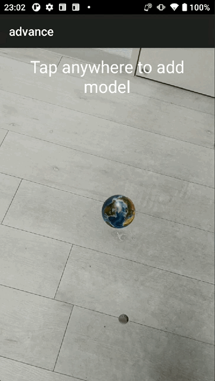

最近看了Google开发者大会。其中介绍到AndroidXR技术。于是想，是不是可以写个demo实现一下？

于是使用Android Studio + ARCore + Sceneform，实现一个月球饶地球转的小Demo。

### 目标

使用Compose组件，ARCore ,Sceneform，实现简易的月球饶地球转AR效果。

效果图




### 实现过程

#### 开发环境

Android Studio Meerkat Feature Drop，gradle-8.11.1。

开发使用的类库

```
[versions]
arCore = "1.43.0"
arsceneview = "2.3.0"

[libraries]
com-google-core-arcore = { group = "com.google.ar", name = "core", version.ref = "arCore" }

io-github-sceneview-arsceneview = { group = "io.github.sceneview", name = "arsceneview", version.ref = "arsceneview" }
```

#### 配制 Build.gradle.kts

```
 implementation(projects.core.designsystem)
 implementation(libs.androidx.appcompat)
 // ARCore & Sceneform
 implementation(libs.com.google.core.arcore)
 implementation(libs.io.github.sceneview.arsceneview)</pre>
```

#### 配制 AndroidManifest.xml

这里要注意下，由于开发是采用的分模块的，在`meta-data` 中要配制`tools:replace="android:value" 。`

由于要使用相机，这里需要声明相机的权限。

```
<manifest xmlns:android="http://schemas.android.com/apk/res/android"
 xmlns:tools="http://schemas.android.com/tools"
 package="com.iblogstreet.explore_ar">

 <uses-permission android:name="android.permission.CAMERA" />

 <uses-feature
 android:name="com.google.ar.core.depth"
 android:required="true" />
 <uses-feature
 android:name="android.hardware.camera.ar"
 android:required="true" />

 <application>
 <meta-data
 android:name="com.google.ar.core"
 android:value="required"
 tools:replace="android:value" />
 ...
 </application>

</manifest>
```

#### 代码实现

`ExploreAREarthWithMoonScreen.kt`

在这里要动态申请权限，权限申请到后，就可以显示页面。

```
@AndroidEntryPoint
class ExploreAREarthWithMoonScreen : AppCompatActivity() {

   override fun onCreate(savedInstanceState: Bundle?) {
        super.onCreate(savedInstanceState)
        setContent {
            Surface(
                modifier = Modifier.fillMaxSize(),
                color = MaterialTheme.colorScheme.background
            ) {
                val context = LocalContext.current
                val (hasPermission, requestPermission) = rememberCameraPermissionState(context)

                LaunchedEffect(Unit) {
                    if (!hasPermission) requestPermission()
                }
                if (hasPermission) {
                    EarthWithMoonScene()
                } else {
                    AlertDialog(
                        onDismissRequest = { },
                        title = { Text("Camera Permission Required") },
                        text = { Text("This app requires camera permission to function properly.") },
                        confirmButton = {
                            TextButton(onClick = requestPermission) {
                                Text("Grant Permission")
                            }
                        }
                    )
                }
            }
        }
    }

}
```

`EarthWithMoonSample.kt`

在这里创建锚点及具体物质结点。

```
val anchorNode = remember { AnchorNode(engine, anchor) }

   val earthNode = remember {
        ModelNode(
            modelInstance = modelLoader.createModelInstance("models/feature_explore_ar_earth.glb"),
            scaleToUnits = 0.1f
        )
    }

    //The moon is about 1/4 the size of the Earth
    val moonNode = remember {
        ModelNode(
            modelInstance = modelLoader.createModelInstance("models/feature_explore_ar_moon.glb"),
            scaleToUnits = 0.027f
        ).apply {
            position = Position(x = 0.3f, y = 0f, z = 0f)
        }
    }

    anchorNode.addChildNode(earthNode)
    anchorNode.addChildNode(moonNode)

    val earthRotation = remember { Animatable(0f) }
    val moonOrbitRotation = remember { Animatable(0f) }
    val moonSelfRotation = remember { Animatable(0f) }

    LaunchedEffect(Unit) {
        launch {
            try {
                while (isActive) {
                    earthRotation.snapTo((earthRotation.value + 1f) % 360f)
                    delay(16L)
                }
            } catch (e: Exception) {
                Log.e("EarthRotation", "Error during earth rotation", e)
            }
        }
        launch {
            try {
                while (isActive) {
                    moonOrbitRotation.snapTo((moonOrbitRotation.value + 1.5f) % 360f)
                    delay(16L)
                }
            } catch (e: Exception) {
                Log.e("MoonOrbitRotation", "Error during moon orbit", e)
            }
        }
        launch {
            try {
                while (isActive) {
                    moonSelfRotation.snapTo((moonSelfRotation.value + 1f) % 360f)
                    delay(16L)
                }
            } catch (e: Exception) {
                Log.e("MoonSelfRotation", "Error during moon self rotation", e)
            }
        }
    }

    LaunchedEffect(earthRotation.value, moonOrbitRotation.value, moonSelfRotation.value) {
        earthNode.rotation = Rotation(y = -earthRotation.value)

        val radians = Math.toRadians(moonOrbitRotation.value.toDouble())
        val x = 0.3f * kotlin.math.cos(radians).toFloat()
        val z = 0.3f * kotlin.math.sin(radians).toFloat()
        moonNode.position = Position(x = x, y = 0f, z = z)

        moonNode.rotation = Rotation(y = moonSelfRotation.value)
    }
```

#### 实现过程遇到的问题

##### 问题描述

如果直接在`rememberOnGestureListener`中，直接向`childNodes` 添加`EarthWithMoonSample`的话，会出现 `@Composable invocations can only happen from the context of a @Composable function` 这个问题。

这里因为`@Composable` 函数只能在其他 `@Composable` 函数中调用。

```
onGestureListener = rememberOnGestureListener(
                onSingleTapConfirmed = { motionEvent, _ ->
                    if (childNodes.isNotEmpty()) {
                        return@rememberOnGestureListener
                    }
                    // Create an anchor at the tapped position
                    val hitResult = frame?.hitTest(motionEvent.x, motionEvent.y)?.firstOrNull()
                    if (hitResult != null && hitResult.isValid()) {
                        planeRenderer = false
                        val anchor = hitResult.createAnchorOrNull()
                        if (anchor != null) {
                            
                            childNodes.add(EarthWithMoonSample( engine = engine,
                                modelLoader = modelLoader,
                                anchor = anchor,
                                materialLoader = materialLoader))
                           
                        }
                    }
                }

            )
```

##### 解决方案

不是直接添加节点，而是将锚点存储在 Compose 状态中。当状态发生变化时，Compose 会自动重组并创建节点。

```
var anchorInstance = remember { mutableStateOf<Anchor?>(null) }

anchorInstance.value?.let {
    childNodes += EarthWithMoonSample(
        engine = engine,
        modelLoader = modelLoader,
        anchor = it,
        materialLoader = materialLoader
    )
}
...
val hitResult = frame?.hitTest(motionEvent.x, motionEvent.y)?.firstOrNull()
                    if (hitResult != null && hitResult.isValid()) {
                        planeRenderer = false
                        val anchor = hitResult.createAnchorOrNull()
                        if (anchor != null) {
                            anchorInstance.value = anchor
                        }
                    }
```

到这里就已经完成了。

#### 官方推荐

如果创建智能手机AR，Sceneform 已过时，建议使用 Jetpack XR + [Filament](https://github.com/google/filament)。

#### 源代码地址

[explore_ar](https://github.com/sayhellotogithub/advanceproject/tree/dev/feature/explore_ar)

#### AI

[ChatGPT](https://chatgpt.com/), [gemini](https://gemini.google.com/app),[claude.ai](https://claude.ai/new)

#### 资源

[sketchfab](https://sketchfab.com/feed)

[sceneview-android](https://github.com/SceneView/sceneview-android)

[Android XR](https://developer.android.com/xr?hl=ja)

[Filament](https://github.com/google/filament)